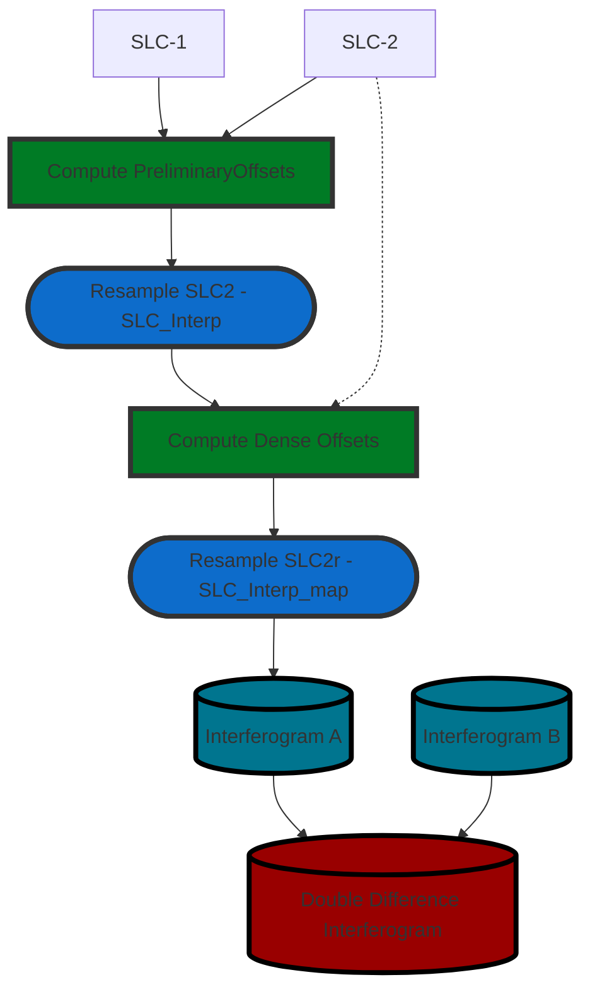

# RADARSAT Constellation Mission (RCM) ICEYE InSAR Processor

[![Language][]][1]
[![License][]][1]

Interferometric processor for Synthetic Aperture Radar (SAR) data from the **[RCM][]**
satellite constellation based on **[GAMMA Software][]**.

**Installation**:

1. Setup minimal **conda** installation using [Miniconda][]

2. Create Python Virtual Environment

    > -   Creating an environment with commands ([Link][]);
    > -   Creating an environment from an environment.yml file
    >     ([Link][2]);

3. Install Python Dependencies

    > ``` bash
    > conda install -y scipy numpy matplotlib tqdm astropy
    > ```

4. Install PyGamma - Python module permits a smooth usage of the Gamma
    Software within Python ([Link][3]);

---
#### DInSAR Workflow - Double-Difference Interferogram Generation Workflow


**PYTHON DEPENDENCIES**:  
- [py_gamma: Gamma Remote Sensing Python Integration][]
- [numpy: The fundamental package for scientific computing with Python][]
- [scipy: Fundamental library for scientific computing][]
- [astropy: A Community Python Library for Astronomy][]
- [matplotlib: Python 2D plotting library][]
- [tqdm: A Fast, Extensible Progress Bar for Python and CLI][]


  [Language]: https://img.shields.io/badge/python-%3E%3D%203.10-blue
  [License]: https://img.shields.io/bower/l/MI
  [1]: ..%20image::%20https://www.python.org/
  [ICEYE]: ..%20image::%20https://www.iceye.com/
  [GAMMA Software]: ..%20image::%20https://www.gammasoftware.com/
  [Miniconda]: https://docs.conda.io/en/latest/miniconda.html
  [Link]: https://docs.conda.io/projects/conda/en/latest/user-guide/tasks/manage-environments.html#creating-an-environment-with-commands
  [2]: https://docs.conda.io/projects/conda/en/latest/user-guide/tasks/manage-environments.html#creating-an-environment-from-an-environment-yml-file
  [3]: https://gamma-rs.ch/uploads/media/upgrades_info_20210701.pdf
  [numpy: The fundamental package for scientific computing with Python]: https://numpy.org
  [py_gamma: Gamma Remote Sensing Python Integration]: http://www.gammasoftware.com/
  [numpy: The fundamental package for scientific computing with Python]: https://numpy.org/
  [scipy: Fundamental library for scientific computing]: https://scipy.org/
  [matplotlib: Python 2D plotting library]: https://matplotlib.org/
  [astropy: A Community Python Library for Astronomy]: https://www.astropy.org/
  [tqdm: A Fast, Extensible Progress Bar for Python and CLI]: https://github.com/tqdm/tqdm
